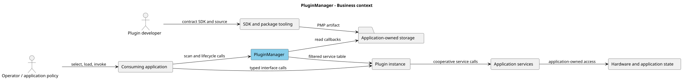
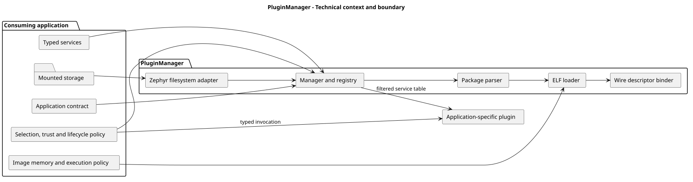

# Context and Scope

## 3.1 Business Context

Source: [`business_context.puml`](../diagram_as_code/03_context_and_scope/business_context.puml).

| Neighbor | Input | Output |
| --- | --- | --- |
| Application | Contract, policy, memory, locks and lifecycle calls | Available metadata, plugin ID, instance pointer and status. |
| Storage adapter | File names, sizes and bytes | Read-only scan/load operations. |
| Plugin package | Manifest, ELF and wire descriptor | Loaded image and registered runtime descriptor. |
| Services | UUID/version/vtable records | Filtered table passed through a `const` API to plugin create. |
| SDK tooling | Contract descriptor and target ELF | Generated SDK files and `.pmp` package. |

## 3.2 Technical Context and Boundary

Source: [`technical_context.puml`](../diagram_as_code/03_context_and_scope/technical_context.puml).

PluginManager does not know an application's instance layout or method semantics. Following `pm_manager_get_instance()`, invocation belongs to the application.

## 3.3 Out of Scope Today

General-purpose linking; automatic package installation or application-data mutation; direct plugin device, filesystem, interrupt or kernel APIs; plugin-created threads; and protection against malicious native code after execution starts.
