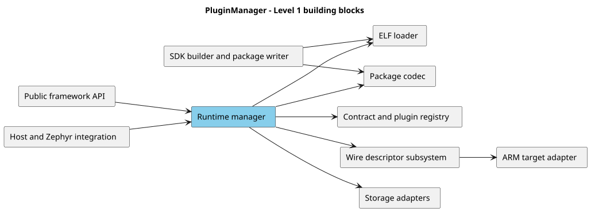

# Building Block View

## 5.1 Level 1: System Decomposition

Source: [`level_1.puml`](../diagram_as_code/05_building_block_view/level_1.puml).

## 5.2 Level 2: Current Building Blocks

| Block | Responsibility | Implementation |
| --- | --- | --- |
| ABI/contracts | Status, UUID, services, descriptors and interfaces. | `include/plugin_manager/plugin_abi.h`, `plugin_contract.h` |
| Runtime | State, discovery, loading, lifecycle and filesystem lifetime. | `src/plugin_manager.c` |
| Registry | Contract/descriptor checks, exact interface lookup, service filtering. | `src/plugin_registry.c` |
| Package codec | PMP v1 build/parse, bounds and image CRC. | `src/plugin_package.c` |
| ELF loader | Recognized section/symbol checks, copy, BSS, relocation and imports. | `src/plugin_elf.c` |
| Descriptor | Decode pointer-free metadata and bind callbacks. | `src/plugin_descriptor.c`, `plugin_descriptor_bind.c` |
| Target adapter | Thumb validation and application-controlled pointer conversion. | `src/plugin_target_arm.c` |
| Generic storage | List, size and read callbacks. | `include/plugin_manager/plugin_manager.h` |
| Zephyr filesystem adapter | Adapt an application-owned mount. | `src/plugin_manager_zephyr.c` |
| SDK builder | Validate JSON, generate runtime/build sources and package ELF. | `sdk-builder/plugin_sdk_builder/` |
| Linker/build | Constrained sections, host/Zephyr compilation. | `cmake/`, `zephyr/`, `CMakeLists.txt`, `Kconfig` |

## 5.3 Runtime Manager Internals

The manager borrows its application contract; owns a bounded registered-plugin array and at most 64 available records; copies the storage adapter while borrowing its context; maintains optional locks and operation state; and retains filtered service tables for active instances. Static descriptors remain application-owned and cannot be unloaded. Loaded records own copied metadata; they borrow fixed image buffers or govern allocator-provided regions through a paired free callback.

## 5.4 Future Building Blocks

| Block | Responsibility |
| --- | --- |
| Trust policy | Signatures, keys, allowlists, revocation and anti-rollback. |
| Package repository | Staging, atomic activation, fallback and audit. |
| Streaming reader | Complete validation with bounded scratch storage. |
| Target profiles | CPU/ABI/toolchain/relocation compatibility. |
| Executable memory provider | Relocate RW, then seal text RX and data RW/NX. |
| Execution supervisor | Stack, deadline, cancellation, faults and health. |
| Capability policy | Interface-supported services, versions, approval and quotas. |
| Diagnostics | Structured validation/lifecycle events and resource use. |
| Host runtime adapter | Host-only shared-library development with the same semantic contract. |
