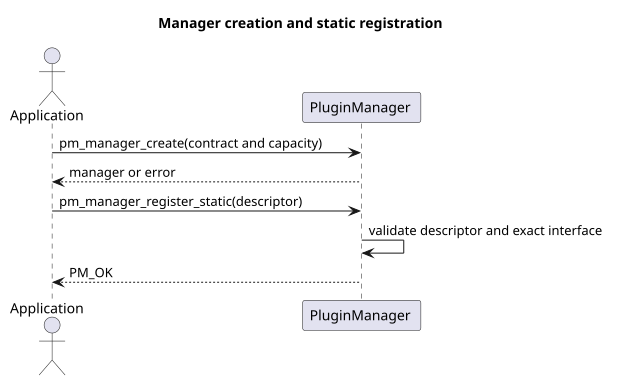
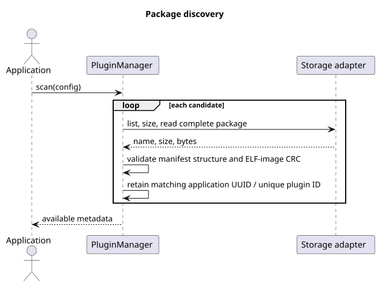
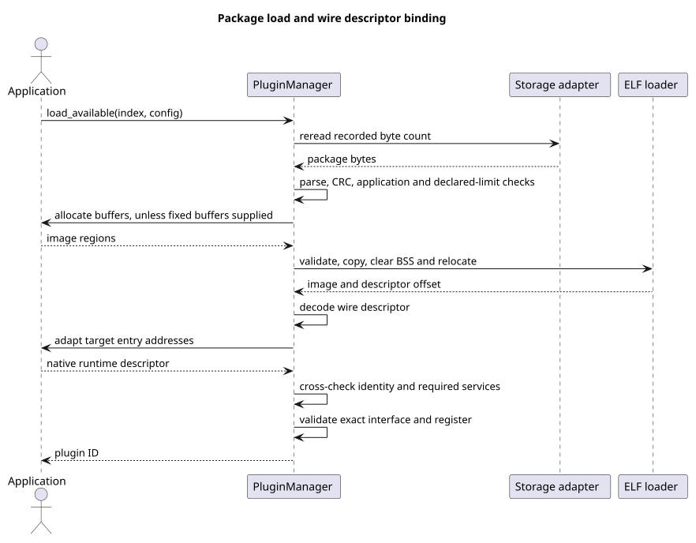
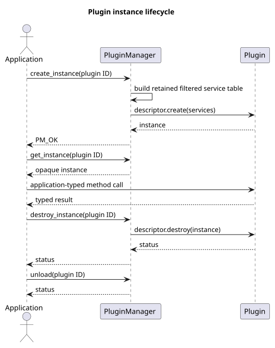
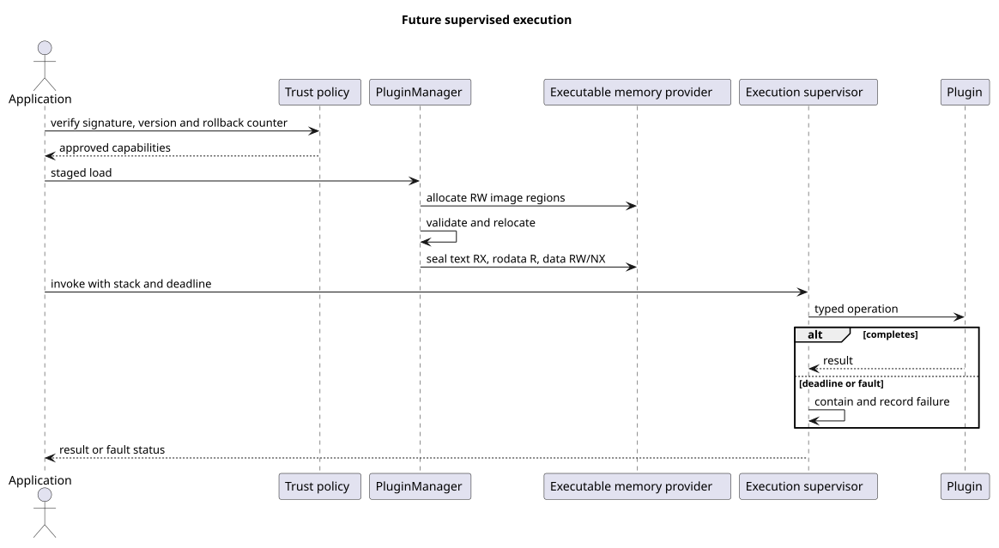

# Runtime View

## 6.1 Creation and Static Registration

Source: [`static_registration.puml`](../diagram_as_code/06_runtime_view/static_registration.puml).

The contract and static descriptor remain application-owned for the manager's lifetime.

## 6.2 Discovery

Source: [`discovery.puml`](../diagram_as_code/06_runtime_view/discovery.puml).

Invalid candidates are skipped. Manifest metadata is not covered by CRC. Scan reads each candidate into temporary heap memory and defers interface compatibility until load.

## 6.3 Load and Bind

Source: [`load_and_bind.puml`](../diagram_as_code/06_runtime_view/load_and_bind.puml).

Interface validation occurs **after** allocation, copy/relocation and adaptation but **before** plugin creation. Failures free allocator-owned image memory and copied descriptor metadata; fixed buffers remain application-owned. `load_available()` rereads the previously recorded size without calling `size()` again.

## 6.4 Instance Lifecycle

Source: [`instance_lifecycle.puml`](../diagram_as_code/06_runtime_view/instance_lifecycle.puml).

Application calls into the plugin occur outside PluginManager; serialize them against destroy/unload. Failed `pm_manager_destroy_instance()` preserves the instance and its services. `pm_manager_destroy()` instead ignores plugin destroy errors, releases services/images and returns `void`; applications should explicitly destroy first. Unload with an active instance returns `PM_EBUSY`.

## 6.5 Future Supervised Execution

Source: [`future_supervision.puml`](../diagram_as_code/06_runtime_view/future_supervision.puml).
