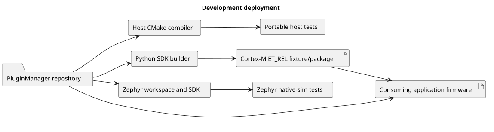
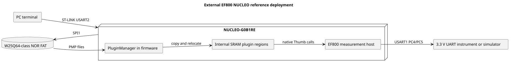

# Deployment View

## 7.1 Development Deployment

Source: [`development.puml`](../diagram_as_code/07_deployment_view/development.puml).

The host static library and target plugin are distinct artifacts. A target plugin is not a Zephyr application: it has no vector table, reset handler or independent kernel runtime.

## 7.2 External Physical Reference Deployment

Source: [`reference_board.puml`](../diagram_as_code/07_deployment_view/reference_board.puml).

Reference settings (not framework defaults): four scanned entries, 32 KiB package limit, 8 KiB text and rodata, 2 KiB data and BSS, one loaded plugin at a time. The reference host uses trusted packages and executable SRAM with MPU disabled. Its source and hardware results live outside this repository.

## 7.3 Future Production Deployment

Production needs separate staging/active locations, protected key and rollback state, atomic activation and known-good fallback, MPU-capable executable regions, optional secure-boot linkage, persistent audit records and a recovery mode that does not execute plugins.
